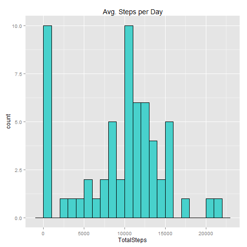
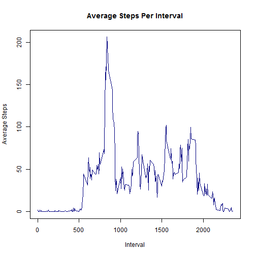
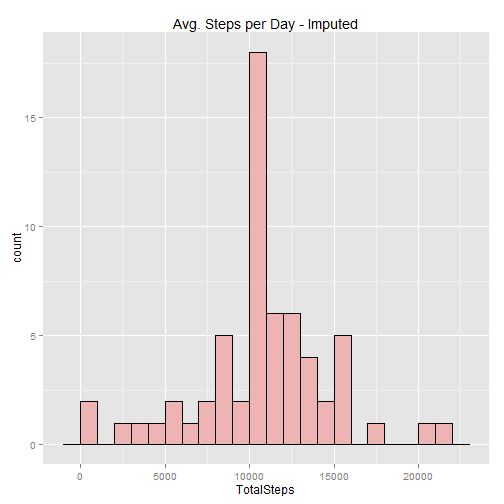
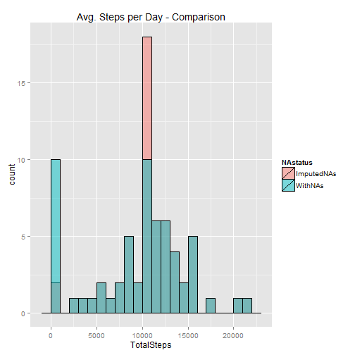
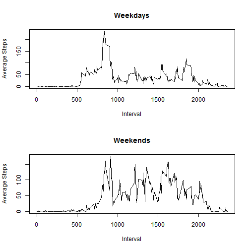

This markdown file documents the steps taken to perform the analysis for Peer Assessment 1 of the Coursera Reproducible Research course. 
  
The analysis uses data from a personal activity monitoring device, which collects data at 5 minute intervals throughout the day. The data, downloaded from the course website [here](https://d396qusza40orc.cloudfront.net/repdata%2Fdata%2Factivity.zip), contains two months of data from an anonymous individual collected during October and November, 2012. The variables included in the data set are:  
 - **steps:** Number of steps taken in a 5-minute interval (missing values are coded as NA)  
 - **date:** The data on which the measurement was taken in YYYY-MM-DD format  
 - **interval:** Identified for the 5 minute interval in which the measurement was taken  
   
The analysis takes part in 5 steps:  
 1. Load and preprocess the data  
 2. Determine total steps per day  
 3. Determine daily activity pattern  
 4. Imputing missing values  
 5. Evaluate differences between weekdays and weekends  
 
##Load and preprocess the data

First, if the data does not already exist in the working directory, it is downloaded and unzipped.


```r
fileUrl<- "http://d396qusza40orc.cloudfront.net/repdata%2Fdata%2Factivity.zip"

#Check if file exists. If not, download
if(!file.exists("./repdata-data-activity.zip")){
    download.file(fileUrl,"./repdata-data-activity.zip")
    datedownloaded = date()
}

#Check if file has been unzipped. If not, unzip
if(!file.exists("./repdata-data-activity")){
    unzip("./repdata-data-activity.zip",exdir="./repdata-data-activity")
}

#Read file into variable Repdata
Repdata <- read.csv("./repdata-data-activity/activity.csv",header=TRUE, na.strings="NA", stringsAsFactors = FALSE)

str(Repdata)
```

```
## 'data.frame':	17568 obs. of  3 variables:
##  $ steps   : int  NA NA NA NA NA NA NA NA NA NA ...
##  $ date    : chr  "2012-10-01" "2012-10-01" "2012-10-01" "2012-10-01" ...
##  $ interval: int  0 5 10 15 20 25 30 35 40 45 ...
```

Data is stored in a dataframe `Repdata`.

##Determine total steps per day

The `plyr` package is used to determine the total number of steps taken per day.


```r
    require(plyr)
    StepsPerDay <- ddply(Repdata,.(date),summarize,TotalSteps = sum(steps,na.rm=TRUE))
```

A histogram of the above data is plotted, using `ggplot2`.


```r
    require(ggplot2)
    plotsteps <- ggplot(StepsPerDay, aes(x=TotalSteps))
    plotsteps + geom_histogram(binwidth = 1000, colour = "black", fill="mediumturquoise") + labs(title="Avg. Steps per Day")
```

 

The mean and median total number of steps taken per day is calculated. 


```r
    mean(StepsPerDay$TotalSteps)
```

```
## [1] 9354
```

```r
    median(StepsPerDay$TotalSteps)
```

```
## [1] 10395
```

##Determine daily activity pattern

Again using `plyr`, the mean steps taken during each 5 minute activity interval is determined by averaged across every day in the two month duration of the data set. This is plotted in a line plot.


```r
    #Calculate average steps for each interval
    StepsPerInterval <- ddply(Repdata,.(interval),summarize,AverageSteps=mean(steps,na.rm=TRUE))

    #Plot the resulting average
    plot(StepsPerInterval$interval,StepsPerInterval$AverageSteps,type="l",col="navy",
         main="Average Steps Per Interval", xlab="Interval",ylab="Average Steps")    
```

 

The interval which contains the highest average number of steps is determined.


```r
    StepsPerInterval$interval[which(StepsPerInterval$AverageSteps == max(StepsPerInterval$AverageSteps))]
```

```
## [1] 835
```

##Imputing missing values

Calculate the total number of rows with missing (`NA`) values. 


```r
    sum(is.na(Repdata$steps))
```

```
## [1] 2304
```

The missing data is filled in. If a value is `NA`, it will be replaced with the mean steps for that value's interval, averaged over the entire two month's worth of data. The imputed data is stored in variable `Repdata.Impute`. This strategy is based on a method discussed on Stackoverflow [here](http://stackoverflow.com/questions/9322773/how-to-replace-na-with-mean-by-subset-in-r-impute-with-plyr).


```r
    #Create function that checks for NA values in the input, and replaces with the average of the input, ignoring NA's.
    impute.mean <- function(x) replace(x,is.na(x), mean(x,na.rm=TRUE))

    #Create a new dataframe, using the formula above to replace NAs
    Repdata.Impute <- ddply(Repdata, ~interval, transform, steps=impute.mean(steps),date=date, interval=interval)

    #Reorder the new dataframe to match the format of the original data
    Repdata.Impute <- Repdata.Impute[order(Repdata.Impute$date, Repdata.Impute$interval),]
    row.names(Repdata.Impute) <- 1:nrow(Repdata.Impute)
```

Plot the new data, and recalculate the mean and median steps taken per data.


```r
    #Calculate steps per interval on imputed data
    StepsPerDay.Impute <- ddply(Repdata.Impute,.(date),summarize,TotalSteps = sum(steps))

    #Plot the results
    plotsteps.Impute <- ggplot(StepsPerDay.Impute, aes(x=TotalSteps))
    plotsteps.Impute + geom_histogram(binwidth = 1000, fill="rosybrown2",colour="black") + 
        labs(title="Avg. Steps per Day - Imputed")
```

 

```r
    #Calculate statistics
    mean(StepsPerDay.Impute$TotalSteps)
```

```
## [1] 10766
```

```r
    median(StepsPerDay.Impute$TotalSteps)
```

```
## [1] 10766
```


After imputing average interval values, the mean steps per day is 10766, compared to 9354 before imputing, an increase of 15 percent. The median steps per day is 10766 after imputing, compared to 10395 after, an increase of 4 percent. The imputation strategy lead to an increase in both median and mean.

An overlay of the histograms before and after imputating is calculated.

```r
    #Create a variable "NAStatus", that differentiates the raw data with the imputed data
    StepsPerDay$NAstatus <- 'WithNAs'
    StepsPerDay.Impute$NAstatus <- 'ImputedNAs'

    #Combine raw and imputed data sets so that they can be plotted together
    StepsPerDay.All <- rbind(StepsPerDay,StepsPerDay.Impute)

    #Plot
    plotsteps.Compare <- ggplot(StepsPerDay.All, aes(TotalSteps,fill=NAstatus))
    plotsteps.Compare + geom_histogram(binwidth=1000,colour="black",alpha=0.5,position='identity') + 
        labs(title="Avg. Steps per Day - Comparison")
```

 

The plot shows that many of the counts that had previously been in the 0-1,000 steps bin have moved to the 10,000-11,000 steps bin. This is a surprising result, as it would be expected that the impute procedure would lead to a distributed increase over multiple bins. Investigation shows that the distribution of `NA` in the original dataset is generally grouped into day-long blocks (so that data from all intervals in a single day is listed as `NA`). The imputation, even though it is implemented at the interval level, effectively operates at the day level because of this grouping. A number of days, which were completely `NA`, are replaced entirely by the average daily total steps, which is 10766. This helps explain the large peak in the ImputedNAs data set.

## Evaluate differences between weekdays and weekends

Using the `lubridate` package, a new variable `Day` is created in the original dataset to differentiate between weekdays (`Day` value of 2-6) and weekends (`Day` value of 1 or 7).


```r
    require(lubridate)

    #Create new variable Day
    Repdata$Day <- wday(as.Date(Repdata$date))
    
    #Subset Weekdays and Weekends based on new variable
    Repdata.Weekday <- subset(Repdata, Repdata$Day==2|Repdata$Day==3|Repdata$Day==4|Repdata$Day==5|Repdata$Day==6)
    Repdata.Weekend <- subset(Repdata, Repdata$Day==1|Repdata$Day==7)
```

The activity levels between weekdays and weekends are compared on a panel plot.


```r
    #Determine average steps for each subset
    StepsPerInterval.Weekday <- ddply(Repdata.Weekday,.(interval),summarize,AverageSteps=mean(steps,na.rm=TRUE))
    StepsPerInterval.Weekend <- ddply(Repdata.Weekend,.(interval),summarize,AverageSteps=mean(steps,na.rm=TRUE))

    #Plot
    par(mfrow=c(2,1))
    plot(StepsPerInterval.Weekday$interval,StepsPerInterval.Weekday$AverageSteps, type="l", 
         main="Weekdays", xlab="Interval",ylab="Average Steps")
    plot(StepsPerInterval.Weekend$interval,StepsPerInterval.Weekend$AverageSteps, type="l", 
         main="Weekends", xlab="Interval",ylab="Average Steps")
```

 

Comparison of the plots shown suggests that the user sleeps in on the weekends, so is less active. The user is generally more active throughout the day on the weekends, suggesting that their job may be relatively sedantary in comparison. 
